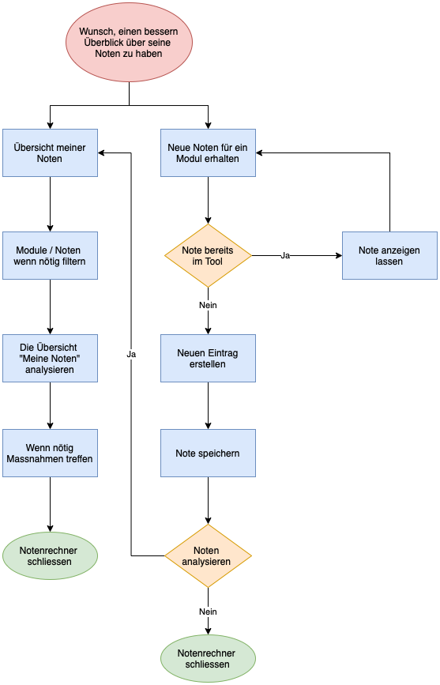

# Notenrechner

## Inhalt
1. [Ausgangslage des Projektes](#ausgangslage-des-projekts)
2. [Betrieb](#betrieb)
3. [Flowdiagramm](#flowdiagramm)
4. [Anleitung](#anleitung)

## Ausgangslage des Projekts

Als Student hat man es nicht immer einfach, mann muss seine Noten im Griff haben, seine Finanzen unter kontrolle und Freunde & Familie sollten auch nicht zu kurz kommen. Um wenigstens eines der drei Themen zu vereinfachen, habe ich mir überlegt, mir das Thema Noten vorzunehmen und einen Notenrechner zu bauen. 

Dieser soll es ermöglichen, seine Noten speichern zu können, diese in die verschiedenen Module zu kategorisieren und auch einen Durchschnitt zu errechnen. Zudem ist der Notenrechner vorgefertigt für den Studiengang Digital Business Management. Er soll den Studierenden einen Überblick über ihren derzeitigen Notenschnitt wie auch ECTS verschaffen. 

## Betrieb

Der Noten Rechner ist so aufgebaut, dass man von der Startseite direkt auf die Inputseite wechseln kann, in welcher man eine neue Note erfassen kann. Für eine neue Note füllt man alle Felder von "Name des Moduls" bis zum Feld "Bewertung des Moduls" aus. Sind alle Daten erfasst, können diese gespeichert werden. Abgespeichert werden die Noten in einem Json-File, welches man unter "Meine Noten" visualisiert betrachten kann.

Unter "Meine Noten" besteht ebenfalls die Möglichkeit, seine Noten bzw. Module nach der Vertiefungsrichtung zu filtern. Unterhalb der Lister werden einem das Summentotal der ECTS, wie auch der Durchschnitt der Noten und der Bewertung.

Die Analyse zeigt dem Studenten wie er, bezogen auf seine ECTS wie auch die Bewertung der Module, im Studium steht. Hier werden die Daten von "Meine Noten" visuell als Diagramme abgebildet. Das erste Diagramm zeigt, wie viele ECTS der Student noch belegen muss, um auf die obligatorische Anzahl der ECTS für Wahlmodule zu kommen. Das zweite Diagramm zeigt, wie man die verschiedenen Vertiefungsrichtungen pro Modul gewertet hat und kann daraus schlüsse ziehen.

## Flowdiagramm



Dieses Flussdiagramm zeigt den Prozess des Notenrechners. Das Flussdiagramm hat sich über das Semester leicht verändert aufgrund von nötigen Anpassungen.

## Anleitung

Damit der Notenrechner funktioniert muss man in der main.py Flask und Plotly installiert haben.
In die daten.py werden die gespeicherten Noten von einträge.json ein- und ausgespielt.

```
from flask import Flask
from flask import render_template
from flask import request
import daten
import plotly.express as px
from plotly.offline import plot
```

```
import json
from datetime import datetime
```

### Funktionen des Notenrechners

**Home:**           Das ist die Index Seite. Hier findest du eine Übersicht des Projekts und man hat die Möglichkeit seine gespeicherten Noten anzuschauen oder eine neue Note/Modul hinzuzufügen.

**Input:**          Hier werden deine neunen Noten eingegeben. Sobald die Felder ausgefüllt und gespeichert wurden, werden diese in dem JSON-File einträge.json gespeichert.

**Meine Noten:**    Diese Funktion verarbeitet die Daten des JSON-Files und gibt diese in einer Liste wieder. Zudem besteht die Möglichkeit die Daten gefiltert anzuzeigen.

**Analyse:**        Hier werden die Daten mit Plotly visuell dargestellt, um die Daten einfacher zu interpretieren und daraus Massnahmen abzuleiten.
